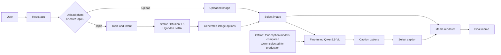

# Uganda AI Meme Studio

An interactive meme generator with two separate model stages: Stable Diffusion creates image candidates when the user starts from a text prompt, and Qwen2.5-VL examines the selected or uploaded image to write caption candidates. Users can upload an image directly and skip image generation.

## Workflow

1. The user uploads a photo or enters a topic and generation options.
2. For an uploaded photo, the frontend shows that photo as the single image candidate; the image-generation model is skipped.
3. For prompt-only generation, the frontend makes three image-generation requests. Each request includes the topic, intent, and a different composition direction (wide scene, candid medium shot, or close expressive framing). With `VITE_MODAL_IMAGE_URL`, requests go directly to Modal and include a random seed; without it, requests go through FastAPI to Hugging Face image inference. The frontend shows the three returned images as candidates.
4. After the user selects an image, the frontend sends that image plus intention, language, and style to `POST /api/memes/generate`.
5. FastAPI builds caption instructions and sends the selected image and prompt to Qwen2.5-VL. It uses Modal when `MODAL_CAPTION_URL` is configured; otherwise, it uses the Hugging Face OpenAI-compatible router. The backend requests three caption variations and returns them to the frontend.
6. The user chooses a caption. FastAPI's `MemeRenderer` draws it onto the selected image through `POST /api/memes/compose`; this final composition step does not call either model. The uploaded-photo "Skip to result" action uses the first returned caption automatically.

The image-generation model and caption model have different jobs. Prompt-only generation asks the image model for three alternatives, then the caption model processes only the image the user selects. Image generation is skipped for an uploaded photo. Modal endpoints can scale to zero while idle, so the first request may take longer while a model starts.

## System architecture



## Model services and configuration

- **Image generation:** Stable Diffusion 1.5 with [`Mwizerwa/ugmeme-sd15-lora`](https://huggingface.co/Mwizerwa/ugmeme-sd15-lora). Prompt-only generation calls it three times with different composition directions. Set `VITE_MODAL_IMAGE_URL` to call the Modal image endpoint directly from the frontend; this Vite variable is read at frontend build/start time. If it is unset, the frontend sends each prompt to FastAPI's `/api/memes/render` endpoint, which calls Hugging Face image inference and needs `HF_API_TOKEN`.
- **Caption generation:** [`Mwizerwa/meme-qwen2.5-vl-finetuned`](https://huggingface.co/Mwizerwa/meme-qwen2.5-vl-finetuned), served by the Modal caption app. Set `MODAL_CAPTION_URL` on the backend to its Web Function URL. If it is unset, the backend uses the Hugging Face router and needs `HF_API_TOKEN`.
- **Secrets:** Keep `HF_API_TOKEN` and Modal credentials on the server. Do not put them in frontend variables or commit them. The browser talks to FastAPI for captions; FastAPI talks to the caption model.

The Docker Space serves the frontend and FastAPI from one origin: `/` serves the app, `/health` reports backend status, and `/api/models` lists supported caption model aliases. Configure `CORS_ORIGINS` with the frontend origin when it is hosted separately from FastAPI. For Modal deployment commands and backend setup, see [backend/README.md](backend/README.md).

## Run locally

Start the backend:

```powershell
cd backend
python -m venv .venv
.\.venv\Scripts\Activate.ps1
pip install -r requirements.txt
$env:PYTHONPATH = "src"
uvicorn app.main:app --reload --port 8000
```

Set `HF_API_TOKEN` in `backend/.env` if using either Hugging Face fallback. The backend uses the existing Modal image and caption endpoints by default; override them with `MODAL_IMAGE_URL` and `MODAL_CAPTION_URL`. In `frontend/.env.local`, set `VITE_API_BASE_URL=http://localhost:8000/api` for a local backend. All image generation, captioning, and composition requests go through that backend. Then run the frontend with `cd frontend`, `npm install`, and `npm run dev`.

For the Hugging Face Space Docker image, build from the repository root with `docker build -t uganda-meme-studio .`.
